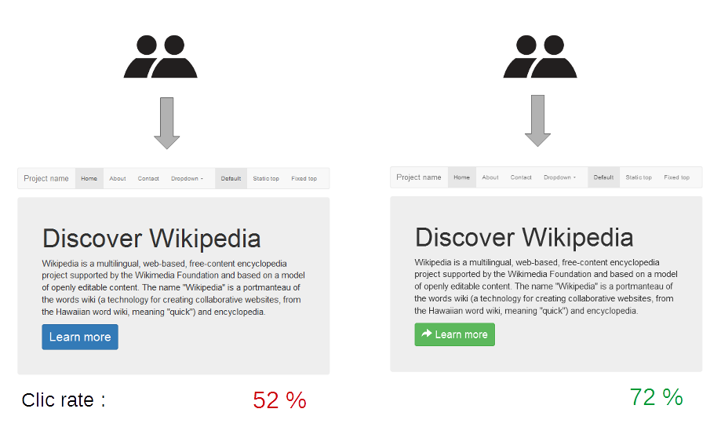

```{r setup, include = FALSE}
knitr::opts_chunk$set(cache = TRUE, autodep = TRUE, message = FALSE)
```

# Introduction

## About the Talk

>- A **light** introduction to Bayesian Statisitics
>- Walk through two examples
>- Introduce **Stan**
>- Look at Bayesian Inference in the wild

Source code available here:
https://github.com/11rchitwood/bs4ds

# Example 1: Going to the Doctor

## The Doctor


>- Ryan: "I don't feel so good..."

## Test Results

>- Doc: "You tested positive for the very rare **BS disease**
that affects 0.1% of the population."
>- Ryan: "Doctor, are you *sure* I have **BS**?"
>- Doc: "Well, the test is 99% accurate..."
>- **What are the chances that I *actually* have BS?**
>- *Hint*: It's not 99%.

## Bayes' Theorem


$$ P(BS \mid test) = \frac{P(test \mid BS) \, P(BS)}{P(test)} $$

## Facts

**We know...**

the test is 99% accurate, so $P(test \mid BS) = 0.99$

the BS prevalence is 0.1%, so $P(BS) = 0.001$

**We don't know...**

the chance of testing positive, $P(test)$

But this can be reformulated:

$$P(test) = P(BS) \times P(test \mid BS) + P(-BS) \times P(test \mid -BS)$$

## Plug and Chug

$$P(BS \mid test) = \frac{0.99 \times 0.001}{0.001 \times 0.99 + (1 - 0.001) \times (1 - 0.99)}$$

```{r bs_calc, include = FALSE}
b_a <- 0.99
a <- 0.001
a_b <- (b_a * a) / ((a * b_a) + ((1 - a) * (1 - b_a)))
```

>- So, there is a `r round(a_b, 2)*100`% chance that Ryan has **BS**

## What's the point?

Bayes' Theorem rocks!

$$
\begin{aligned}
\overbrace{p(\theta | \text{Data})}^{\text{posterior}} &= \frac{\overbrace{p(\text{Data} | \theta)}^{\text{likelihood}} \times \overbrace{p(\theta)}^{\text{prior}}}{\underbrace{p(\text{Data})}_{\text{marginal likelihood}}} \\
&\propto p(\text{Data} | \theta) \times p(\theta) \\
\end{aligned}
$$

We can confront a **model** with the **data** and incorporate our **prior** understanding to draw inference about parameters of interest.

# Back to Data Science

## Setup

For the next example, we'll be working in **R** using these packages:

```{r package_setup, message=FALSE}
library("tidyverse")
library("rstan")
library("bayesplot")
```

But all of this can be ported to Python.

We'll also use **Stan**.

## This is Stan


> **"Stan"** is a song by American rapper Eminem featuring English singer Dido. 

## No wait, *this* is Stan


> Stan® is a state-of-the-art platform for statistical modeling and high-performance statistical computation.

## What is Stan? 

>- Probabilistic programming language
>- Implements fancy HMC algorithms
>- Written in C++ for *speed*
>- Interfaces for R (rstan), python (pystan), etc.
>- Active developers on cutting-edge of HMC research
>- Large user community

# Example 2: Testing on the Web

## The Manager


>- Manager: "We're testing an exciting new web feature!"

## Version A


## Version B


## The Question


>- Manager: "Which version yields more conversions?"

## The Data

```{r data}
visitors = c(A = 1300, B = 1275)
conversions = c(A = 120, B = 125)
```

```{r data_plot, echo = FALSE}
data <- tibble(visitors, conversions) %>% 
  mutate(version = factor(c("A", "B")),
         non_conversions = visitors - conversions) %>% 
  select(-visitors) %>% 
  gather(type, visitors, -version)
data %>% 
  ggplot(aes(version)) +
  geom_bar(aes(weight = visitors, fill = type)) +
  theme_minimal()
```

<!-- TODO Fix bottom of fig getting cut off -->

## The Model

The model of the experiment is an A/B test in which 
$$
\begin{aligned}
n_A &\sim \mathsf{Binomial}(N_A, \pi_A) & n_B &\sim \mathsf{Binomial}(N_B, \pi_B) \\
\pi_A &= \mathsf{InvLogit}(\eta_A) & \pi_B &= \mathsf{InvLogit}(\eta_B) \\
\eta_A &= \mathsf{Normal}(0, 2.5) & \eta_B &= \mathsf{Normal}(0, 2.5)
\end{aligned}
$$

>- The model
>- A link function
>- The priors

## Implementation in Stan

```{r stan_model, comment = "", echo = FALSE}
cat(readLines("stan/abtest.stan"), sep = "\n")
```

## Run and fit the model

```{r fit_model, message = FALSE}
abtest_data <- list(visitors_A = visitors["A"],
                    visitors_B = visitors["B"],
                    conversions_A = conversions["A"],
                    conversions_B = conversions["B"])

abtest_fit <- rstan::stan("stan/abtest.stan", data = abtest_data,
                          chains = 1, iter = 1000, refresh = 0)
```


## Calculate the probability that $\pi_A$ 

```{r, prob_calc}
pi_A <- drop(rstan::extract(abtest_fit, "pi_A")[[1]])
pi_B <- drop(rstan::extract(abtest_fit, "pi_B")[[1]])
mean(pi_A > pi_B)
mean(pi_A < pi_B)
```

>- Looks like Version B wins!

## Plot posteriors

```{r posterior_plot, echo = FALSE}
posterior <- as.matrix(abtest_fit)
mcmc_areas(posterior, pars = c("pi_A", "pi_B"))
```

# Bayesian Inference in the Wild

## A/B Testing



## Email Spam Filters


## NYC Real Estate Pricing


## Estimating number of WWII tanks


# Conclusion

## Summary

>- Directly estimate parameter of interest (with uncertainty!)
>- Use prior to incorporate domain expertise (or not!)
>- Separate *model* from **estimation**
>- Separate *inference* from **decision**

## Resources

- [The Bayesian Trap by Veritasium](https://www.youtube.com/watch?v=R13BD8qKeTg)
- [Introduction to Stan by Jeffrey Arnold](https://github.com/jrnold/presentation-2018-11-05)
- [Probabilistic Programming & Bayesian Methods for Hackers](http://camdavidsonpilon.github.io/Probabilistic-Programming-and-Bayesian-Methods-for-Hackers/)

## Thanks!


<!-- TODO Fix bottom of image getting cut off -->

[Explanation](https://www.explainxkcd.com/wiki/index.php/1132:_Frequentists_vs._Bayesians)
